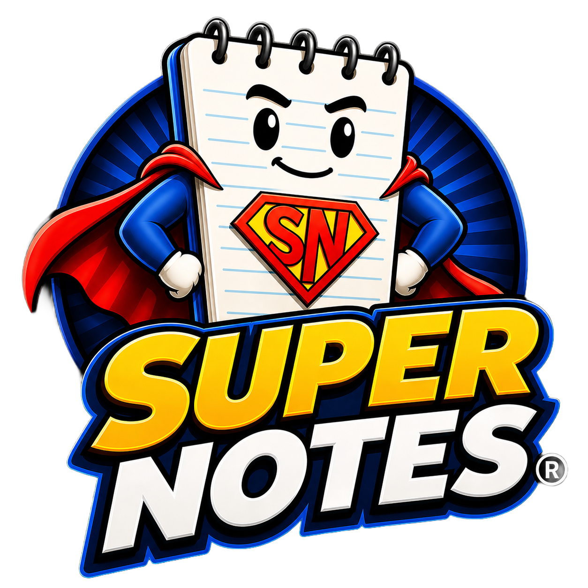
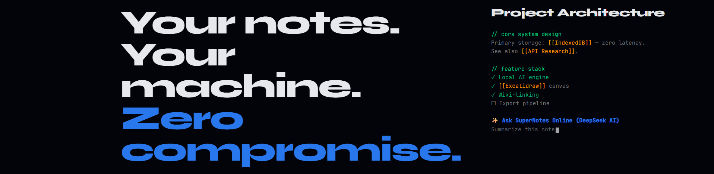
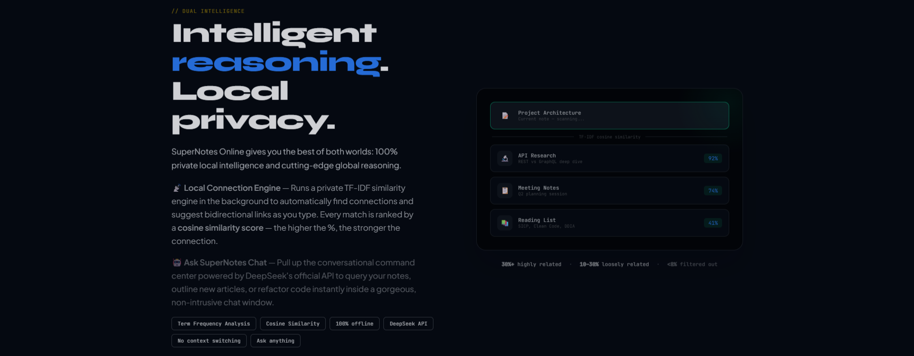
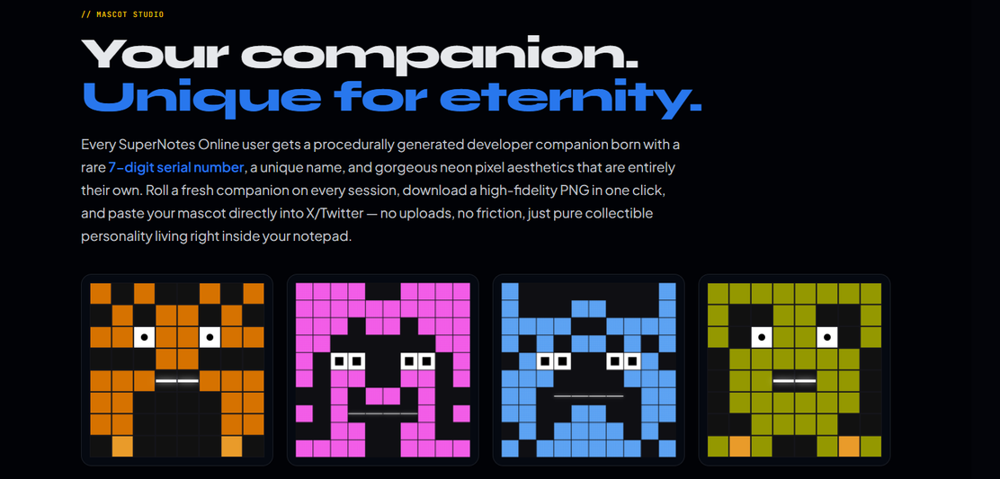

**Your thoughts. Your machine. No cloud. No account. No compromise.**

<!-- badges hidden for now

-->

---

---

## Overview

SuperNotes stores everything in your browser's **IndexedDB** — no servers, no accounts, no tracking. It runs completely offline, works as a PWA on any device, and requires zero setup from first keystroke to last.

**[→ Launch the app](https://supernotes.online)** &nbsp;|&nbsp; **[→ Launch Info Page](https://promo.supernotes.online)**

---

## Privacy First

<strong>100% Local & Private — details</strong>

- **Zero Cloud:** All your notes, media, and checklists live in **IndexedDB** — zero server calls, ever
- **Full Offline Operation:** Works on a plane, in a bunker, or anywhere with zero internet
- **No Accounts:** No emails, no sign-ups, no tracking cookies — completely anonymous from day one

---

## Features

<strong>Integrated Excalidraw Infinite Canvas</strong>

- **Sketch side-by-side:** Launch an infinite vector whiteboard directly inside your notes with one click
- **No context switching:** Architecture diagrams, mind maps, wireframes — all without leaving your editor

<strong>Bidirectional Wiki Linking</strong>

- **Simple syntax:** Type `[[` to instantly link any two notes together
- **Hover previews:** See the target note's content in a popup before clicking
- **Automatic backlinks:** Every link tracked in real-time — explore your knowledge graph effortlessly

---

## AI Engine

<strong>Dual Intelligence AI — details</strong>

- **Local Connection Engine:** TF-IDF cosine similarity runs in-browser — surfaces related notes as you type, no API keys, no latency
- **Ask SuperNotes Chat:** DeepSeek API integration for a conversational command center — summarize, brainstorm, or refactor code instantly

---

## Mascot Studio

<strong>Procedural Companions — details</strong>

- **Over 1.1 quadrillion unique combinations** — your companion is genuinely, permanently yours
- **Unique DNA:** Every mascot has a rare 7-digit serial number, custom name, and neon pixel aesthetic
- **Native Share:** Post your mascot directly to X, Instagram, iMessage, or anywhere via the native share sheet

---

## Multimedia

<strong>Rich Media Support — details</strong>

- **One-click formatting:** Packages notes for X, LinkedIn, Slack, Discord, or Email
- **HTML Export:** Fully styled, self-contained offline files that look perfect on any device
- **Embedded YouTube:** Drop any YouTube URL and it plays right inside your note

---

## How It Stacks Up

| Feature | SuperNotes | Notion | Obsidian | Evernote |
|---------|:---:|:---:|:---:|:---:|
| 100% Private & Local | ✦ | ✗ | ✓ | ✗ |
| Works Fully Offline | ✦ | ✗ | ✓ | ~ |
| Free Forever | ✦ | ~ | ✓ | ~ |
| No Account Required | ✦ | ✗ | ✓ | ✗ |
| Built-in AI Engine | ✦ Local + Chat | ~ Paid | ~ Plugin | ~ Paid |
| Infinite Canvas | ✦ Excalidraw | ✓ | ~ Plugin | ✗ |
| Bidirectional Wiki Links | ✦ | ✓ | ✓ | ✗ |
| Social Export Suite | ✦ | ✗ | ✗ | ✗ |
| Digital Companions | ✦ 1.1 quadrillion | ✗ | ✗ | ✗ |

---

## Tech Stack

| Layer | Technology | What it does |
|-------|-----------|---------|
| Storage | **IndexedDB** | All notes and media — zero server calls |
| Canvas | **Excalidraw** | Infinite vector whiteboard embedded in the editor |
| Local AI | **TF-IDF Engine** | Surfaces related notes in-browser, no API |
| Chat AI | **DeepSeek API** | Optional conversational assistant |
| Color | **OKLCH** | Perceptually uniform color space |
| Publishing | **Blotato** | Social media automation & API |
| Runtime | **Vanilla JS + HTML5** | Zero frameworks, zero build steps, zero dependencies |

---

## Get Started

1. Visit **[supernotes.online](https://supernotes.online)** — no install, no sign-up
2. Start writing — your notes are yours, forever, offline
3. Have fun with Mascot Studio!

---

## Support the Project

SuperNotes is free. If it's boosted your productivity, consider buying us a coffee.

---

## License

Copyright © 2026 SuperNotes. All rights reserved. Proprietary — unauthorized copying, modification, or commercial use is strictly prohibited.
